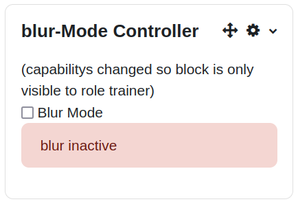
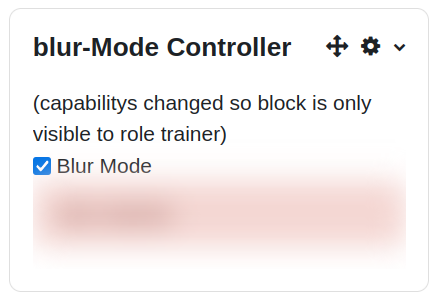
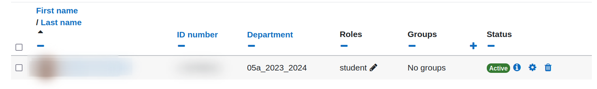
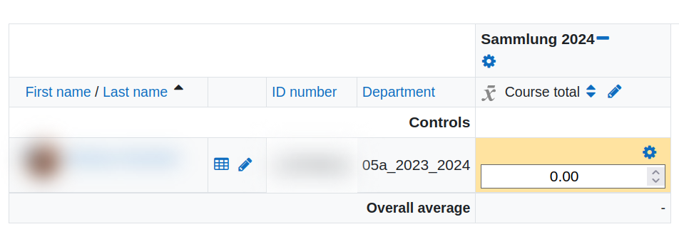
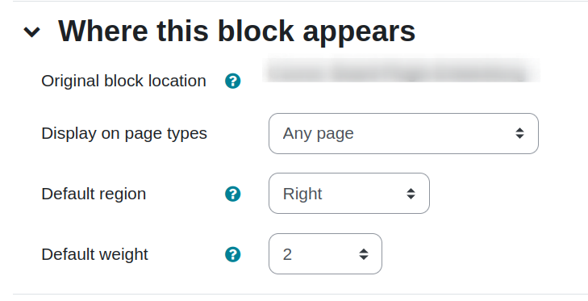
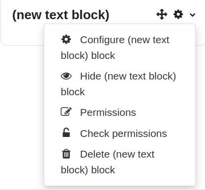
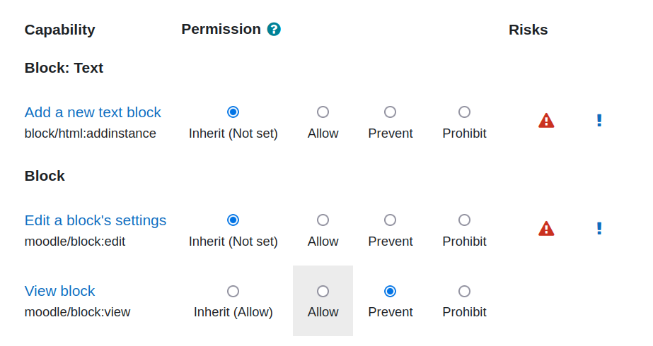

# About this code:</b>  
In some cases when you show an user your moodle course you do not want to show data like name of students for data privacy reason.  
This code can be used to add a blur-functionality to a course so that some data is blured.  
You can turn blur mode on and of using the local storage of the browser to remember the setting on all pages.  
The block has to be configured to be displayed on ALL pages of the course so that the block add the functionality on all pages eg participant page.  

Author/Copyright:  
Andreas Schenkel based on code and ideas from Matthias Giger https://github.com/mattgig and Florian Dagner https://github.com/fdagner

## Blur mode inactive  

## Blur mode active  

This setting is stored in the localstorage of the browser so that the blur feature will be still activ after reloading the page.

The feature might depends on the choosen moodletheme. So please test the features in your moodle and change the selectors if needed.

# Example-blur
## particiant list:
The participant list might look like this:

## grader report:
The grader report might look like this:

# Additional selectors   
If you need more selectors you can add them in the function changeBlurMode().

Example for the class selector additionalselector:  

Add the following line in the definition of let selector =  

            ".additionalselector,\n" +

# Usage

1. Go to yout settings page and change the editor preferences to "plain text area".
2. Go to yout moodlecourse where you want to use the blur feature.
3. Add a text block to your moodlecourse.
4. Edit the content of your text block and copy and paste the content of blurmode_controller.html into the block.
5. In order to have this block on every page of the course set "Display on page types" to "Any page":

6. Do not forget to save your changes.

7. If you only want to show this block to teachers and not to students then you have to adapt the permissions of the block.

Select "permissions" in the dropdown of the block

prevent moodle/block:view 

